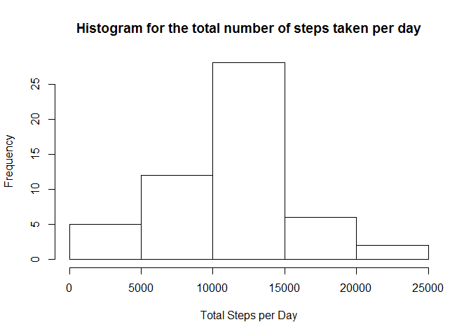
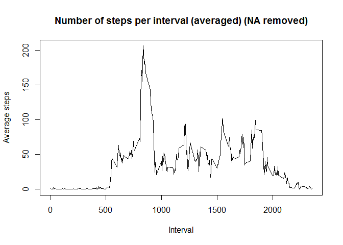
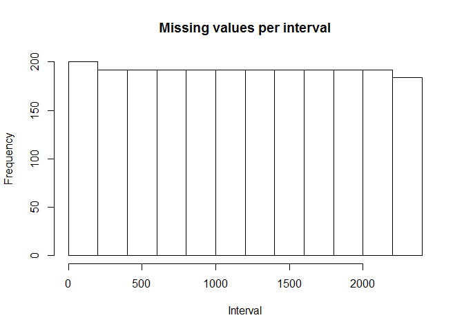
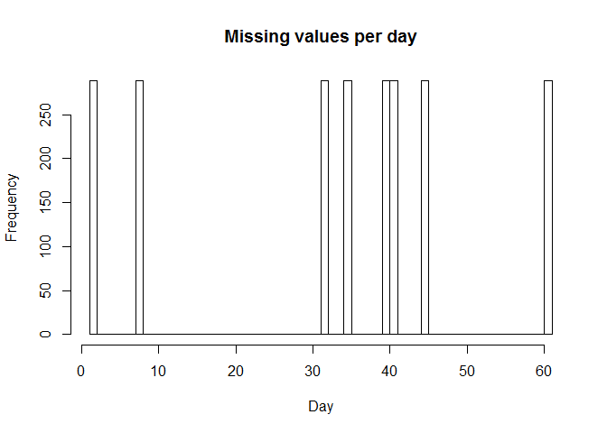
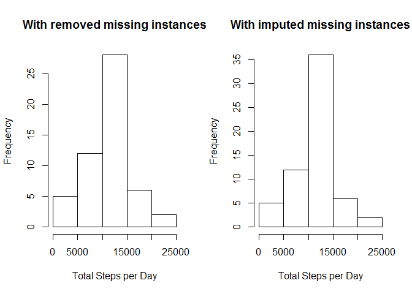
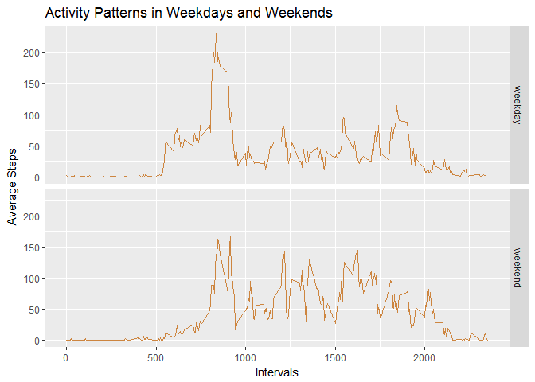

## Loading and preprocessing the data


1. import necessary libraries


```r
library(ggplot2)
```
2. Load the Data


```r
if(!file.exists('activity.csv')){
    unzip('activity.zip')
}
activityData <- read.csv('activity.csv')
```


## What is mean total number of steps taken per day?

1. Get the histogram of total number of steps taken each day


```r
totalStepsPerDay <- aggregate(steps ~ date, data = activityData, FUN = sum, na.rm = TRUE)
hist(totalStepsPerDay$steps, xlab = "Total Steps per Day", main = "Histogram for the total number of steps taken per day")
```

<!-- -->

2. Mean and median of the total number of steps taken per day

```r
MeanStepsPerDay <- mean(totalStepsPerDay$steps)
MeanStepsPerDay
```

```
## [1] 10766.19
```

```r
MedianStepsPerDay <- median(totalStepsPerDay$steps)
MedianStepsPerDay
```

```
## [1] 10765
```
## What is the average daily activity pattern?

1. Time series plot of the 5-minute interval (x-axis) and the average number of steps taken, averaged across all days (y-axis)


```r
MeanStepsPerInterval <- aggregate(steps ~ interval, data = activityData, FUN = mean, na.rm = TRUE)
plot(MeanStepsPerInterval$interval, MeanStepsPerInterval$steps, type = "l", xlab = "Interval", ylab = "Average steps", main = "Number of steps per interval (averaged) (NA removed)")
```

<!-- -->

2.Which 5-minute interval, on average across all the days in the dataset, contains the maximum number of steps?


```r
maxStepsCount <-max(MeanStepsPerInterval$steps)
maxStepsCount
```

```
## [1] 206.1698
```

```r
intervalWithMaxSteps <- MeanStepsPerInterval$interval[which(MeanStepsPerInterval$steps == maxStepsCount)]
intervalWithMaxSteps
```

```
## [1] 835
```

## Imputing missing values
1. The total number of missing values in the dataset (i.e. the total number of rows with NAs)

```r
sum(is.na(activityData))
```

```
## [1] 2304
```
2. Devise a strategy to fill missing values

We first run a simple analysis to find out the missing values distribution per interval and day

```r
missingValues <- subset(activityData, is.na(steps))
hist(missingValues$interval,xlab = "Interval", main="Missing values per interval")
```

<!-- -->

```r
hist(as.numeric(missingValues$date), xlab="Day", main = "Missing values per day",breaks=61)
```

<!-- -->

It is clear that all the missing values are distributed over a few dates. Therefore we use the mean over 5-minute interval to replace NA's

3. Create a new dataset with the missing data filled in

```r
missingDataInstances <- activityData[is.na(activityData$steps),]
completeDataInstances <- activityData[!is.na(activityData$steps),]
missingDataInstances$steps <- as.factor(missingDataInstances$interval)
MeanStepsPerInterval <- tapply(activityData$steps, activityData$interval, mean, na.rm = TRUE)
levels(missingDataInstances$steps) <- MeanStepsPerInterval
levels(missingDataInstances$steps) <- round(as.numeric(levels(missingDataInstances$steps)))
missingDataInstances$steps <- as.integer(as.vector(missingDataInstances$steps))
imputedActivityData <- rbind(missingDataInstances, completeDataInstances)

sum(is.na(imputedActivityData))
```

```
## [1] 0
```

4.1 Get the histogram of total number of steps taken each day

```r
par(mfrow = c(1,2))
hist(totalStepsPerDay$steps, xlab = "Total Steps per Day", main = "With removed missing instances")

totalStepsPerDay2 <- aggregate(steps ~ date, data = imputedActivityData, FUN = sum)
hist(totalStepsPerDay2$steps, xlab = "Total Steps per Day", main = "With imputed missing instances")
```

<!-- -->

4.2 Calculate and report the mean and median total number of steps taken per day for the new dataset

```r
MeanStepsPerDayNew <- mean(totalStepsPerDay2$steps)
cat("Mean Steps per day with removed missing values: ", MeanStepsPerDay)
```

```
## Mean Steps per day with removed missing values:  10766.19
```

```r
cat("Mean Steps per day with imputed missing values: ", MeanStepsPerDayNew)
```

```
## Mean Steps per day with imputed missing values:  10765.64
```

```r
MedianStepsPerDayNew <- median(totalStepsPerDay2$steps)
cat("Median Steps per day with removed missing values: ", MedianStepsPerDay)
```

```
## Median Steps per day with removed missing values:  10765
```

```r
cat("Median Steps per day with imputed missing values: ", MedianStepsPerDayNew)
```

```
## Median Steps per day with imputed missing values:  10762
```

Data imputation introduce small difference to the mean and median values where both values are reduced.
According to the histograms imputed dataset has higher frequency for the maximum total number of steps.

## Are there differences in activity patterns between weekdays and weekends?

1. Create a new factor variable in the dataset with two levels - "weekday" and "weekend" indicating whether a given date is a weekday or weekend day.


```r
imputedActivityData$dayType <- ifelse(as.POSIXlt(imputedActivityData$date)$wday %in% c(0,6), 'weekend', 'weekday')
imputedActivityData$dayType <- factor(imputedActivityData$dayType)
```

2. Create Time series plots for Weekdays and Weekends


```r
stepsPerIntervalAndDayType <- aggregate(steps ~ interval + dayType, data = imputedActivityData, FUN = mean)
names(stepsPerIntervalAndDayType) <- c("interval", "dayType", "meanSteps")
plot <- ggplot(stepsPerIntervalAndDayType, aes(interval, meanSteps))
plot + geom_line(color = "tan3")+facet_grid(dayType~.) + labs(x = "Intervals", y = "Average Steps", title = "Activity Patterns in Weekdays and Weekends")
```

<!-- -->

There is a difference between the activity patterns in weekdays and weekends. In weekdays activites are started earlier than the weekends and in weekdays there is a peak during the early hours while in weekends activities are almost equlaly spreded throughout the day.
